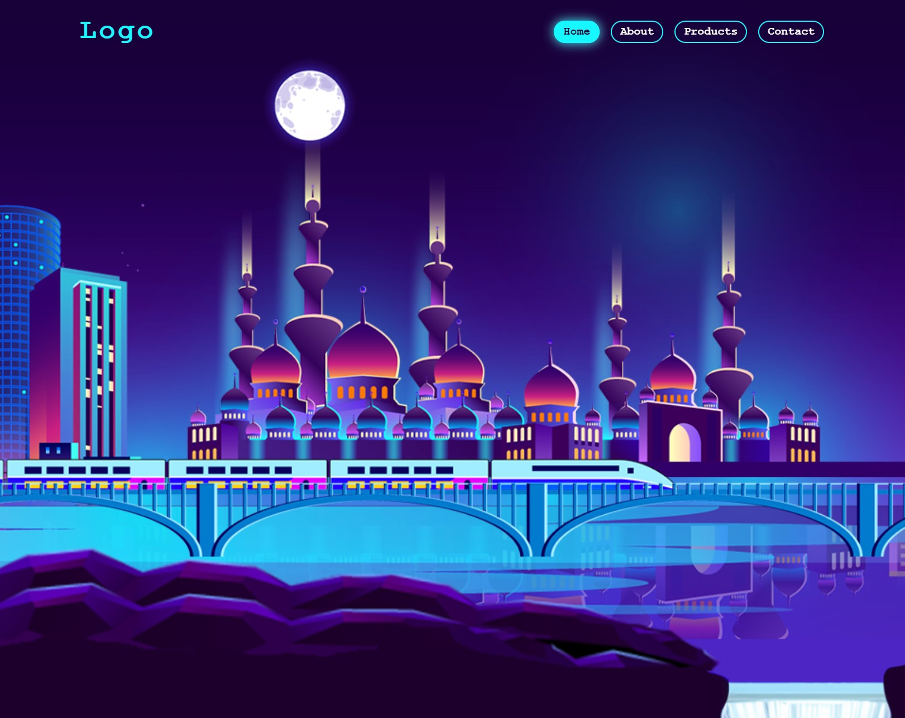
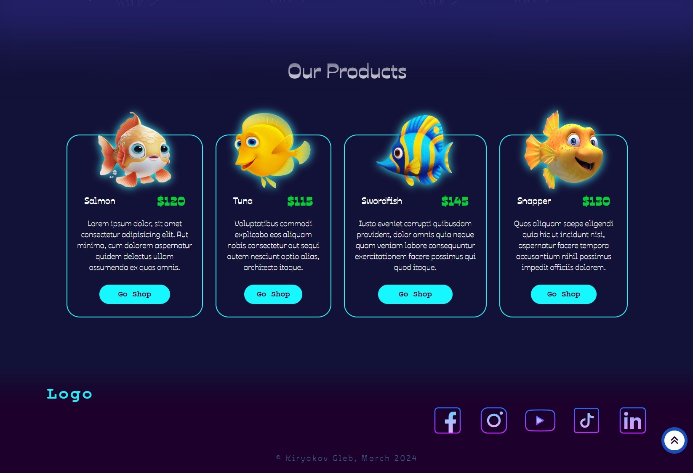

# **_Alive night city parallax effects website_**

## About

Crazy alive night city website w/ scrolling parallax animation effects!
​
> version: Mar 2024, created by Gleb 'Faitsuma' Kiryakov

## Preshow

  
   
  
   
  
   

## Documentation

* GSAP animation docs: https://gsap.com/docs/v3/GSAP;
* Boxicons: https://boxicons.com/usage;
* JS docs: https://developer.mozilla.org/en-US/docs/Web/JavaScript;
* HTML docs: https://developer.mozilla.org/en-US/docs/Web/HTML;
* CSS docs: https://developer.mozilla.org/en-US/docs/Web/CSS;
* SCSS docs: https://sass-lang.com/documentation/;
* SCSS compile hero pro extension: https://marketplace.visualstudio.com/items?itemName=Wscats.eno
* Google Fonts: https://fonts.google.com;
* Git: https://githowto.com/ru;
* Color Picker: https://www.w3schools.com/colors/colors_picker.asp;